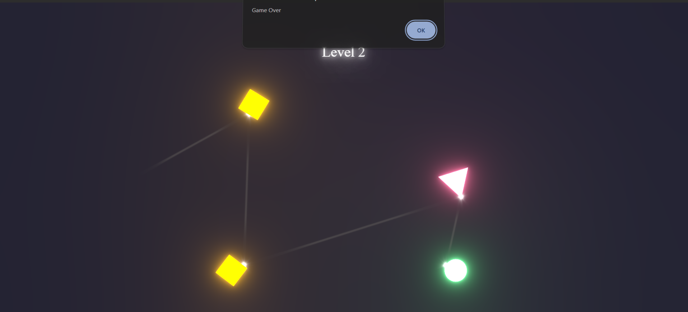

# Reflect Game

Prototype of a light reflection game made with React Three Fiber.  

## Credit
I started from an existing light reflection project made by someone else but I can't find the original repo on github.  
If you are this person or know the project please contact me.  

## The Game description

I turned the former light reflection system into a puzzle game by :  
- Setting a game rule : you win if the light bounces on all the colored shapes  
- Creating a level system : Winning a level leads with a smooth transition to another one if it exists or the a Game Over otherwise  
- Shaping a game design : Each level contains a different design with different shapes and/or different shape positions/rotations  
- Implementing data persistence : saving playing advancement into localstorage  

I also updated the former mouse handling system because the light ray rotated automatically depending on the mouse position compared with the screen center.  
It was very limitating the game design possibilities so I made the light ray stay still on the pointer moving and rotating only on click holding.  

## Live Demo
[Click Here](https://tolexia.github.io/Reflect-Game/) 

## Preview
